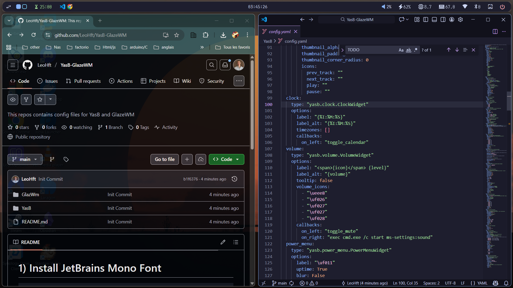
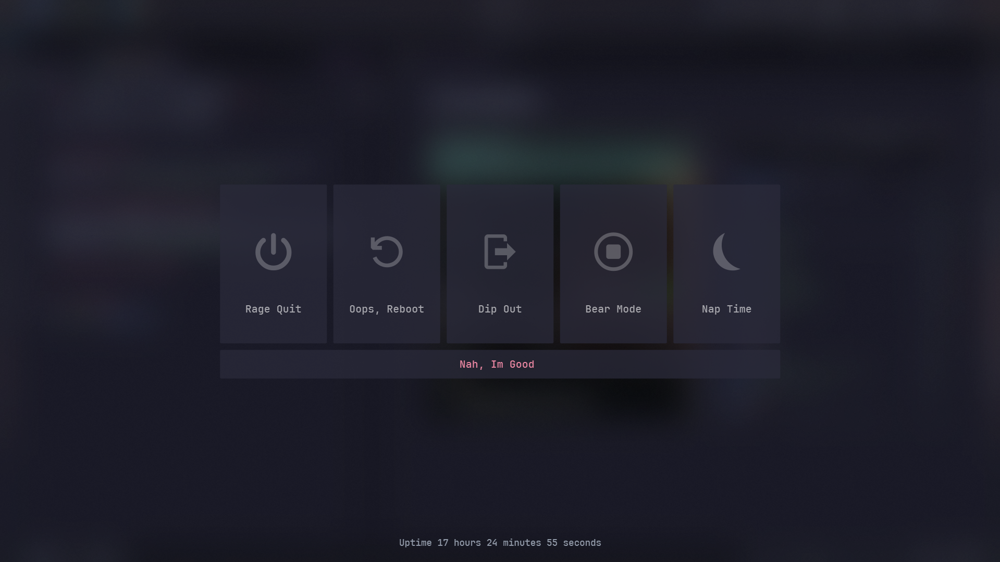

>This build is a personnal modification of `SleppyCatHey` build see [his video](https://youtu.be/b57zFm3nVxA?si=WG6pTmxCN2TZCFID).

# 1) Install JetBrains Mono Font
```
https://github.com/ryanoasis/nerd-fonts/releases/download/v3.4.0/JetBrainsMono.zip
```

# 2) Install YasB
```
https://github.com/amnweb/yasb/wiki/Installation
```
Launch YasB and copy Past the YasB config files into your YasB config folder under `C:\Users\username\.config\yasb`

> You can update your wallpapers folder on line 153  
> image_path: "C:\\Users\\username\\Pictures"  # TODO Example path to folder with images


# 3) Install GlazeWM without Zebar
```
https://github.com/glzr-io/GlazeWM/releases
```  
Launch GlazeWM, it will crash, but it will also create a new config folder.  
Copy Past the GlazeWM config files into the GlazeWm config folder under `C:\Users\username\.glzr\glazewm`.
Relaunch GlazeWM after that.

# 4) Run YasB and GlazeWM


# 5) Sreenshots  
## Normal use



## Power menu  
